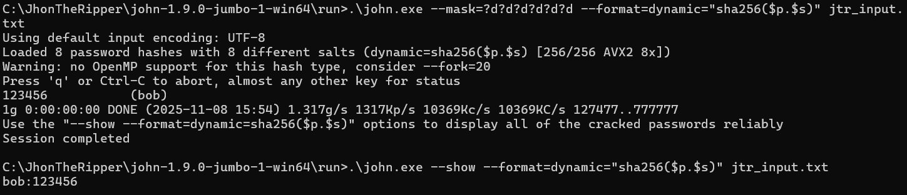
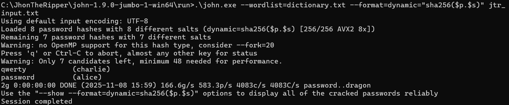
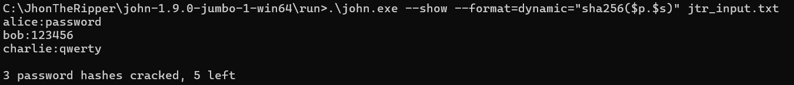

# Progetto di Sicurezza dell'Informazione M: Implementazione di Funzioni di Hash e Analisi di Attacchi

## Introduzione
Questo progetto mira a fornire una comprensione pratica delle funzioni di hash crittografiche e delle loro vulnerabilità agli attacchi di cracking di password come  brute-force e dictionary-based. Verranno implementate funzioni di hashing con salt per la protezione delle password a cui seguiranno simulazioni di attacco. Infine, si farà uso di John the Ripper come strumento esterno per confrontare l'efficacia e le prestazioni degli attacchi implementati.

## Obiettivi

* Implementare una funzione di hash con salt per la gestione sicura delle password.
* Simulare attacchi brute-force e dictionary-based per indovinare password.
* Preparare un output compatibile con John the Ripper.
* Confrontare l'efficacia e le prestazioni delle simulazioni con quelle di John the Ripper.
* Analizzare le implicazioni sulla sicurezza delle password e le strategie di mitigazione.

## Architettura del Progetto

Il progetto è strutturato nei seguenti moduli Python:

* main.py: Il punto di ingresso del programma, che coordina la generazione degli hash e l'esecuzione delle simulazioni di attacco.
* hash_functions.py: Contiene l'implementazione della funzione di hashing con salt (utilizzando SHA256) e una funzione di verifica della password. Include anche un esempio di funzione di hash molto semplificata a scopo didattico.
* password_manager.py: Si occupa della creazione di un file contenente username e hash di password (simulando un database utente) e del caricamento di questi dati.
* attack_simulations.py: Implementa le logiche per gli attacchi di tipo brute-force e dictionary-based.
* data/: Una directory per contenere i file di input/output, come il file degli hash degli utenti (users.txt), il dizionario per gli attacchi (dictionary.txt) e il file da dare in input a John the Ripper (jtr_input.txt)

## Per una corretta esecuzione del Progetto

1.  Creare la cartella data.

4.  Creare un file data/dictionary.txt con una lista di parole comuni (una per riga) per l'attacco dictionary-based.

5.  Esegui lo script principale (main.py) genererà il file data/users.txt e il file data/jtr_input.txt e avvierà le simulazioni di attacco.

6. Ogni file ha al suo interno dei test (eseguibili lanciando il singolo file) che permettono di verificarne il funzionamento.

## Utilizzo con John the Ripper

Il file data/jtr_input.txt generato dal programma è già in un formato che John the Ripper può leggere.
I dati sono scritti come username:hash$salt. John the Ripper è in grado di parsare questo formato e riconoscere il salt.

Il comando utilizzato per l'attacco a dizionario è:
.\john.exe --wordlist=dictionary.txt --format=dynamic="sha256($p.$s)" jtr_input.txt

Il comando utilizzato per l'attacco brute force è:
.\john.exe --mask=?d?d?d?d?d?d --format=dynamic="sha256($p.$s)" jtr_input.txt

Per visualizzare le password crackate il comando è:
.\john.exe --show --format=dynamic="sha256($p.$s)" jtr_input.txt

La stringa dynamic="sha256($p.$s)" istruisce JtR:

* sha256(...): Usare l'algoritmo SHA-256.
* $p: Prendere la password dal dizionario o dal brute-force.
* .:  Concatenarla con ciò che viene dopo.
* $s: La parte dopo il $ nel file jtr_input.txt, ovvero il salt.

**Esempi di comandi con John the Ripper:**

* **Attacco Brute-Force (incremental mode):**

    

* **Attacco Dictionary-Based:**

    

* **Visualizzazione risultati**
    

## Analisi e Conclusioni

*   Confronto tra JtR e simulazione Python:
    Sia la simulazione che l'uso di John the Ripper hanno successo nel crackare password deboli come quelle di alice, bob e charlie, convalidando la logica di verify_password_salted. Il modello teorico e l'attacco pratico sono risultati allineati.

*   Efficacia e limiti dell Salt:
    Il salt è stato efficace contro gli attacchi Rainbow Table. Questo perchè ogni utente ha un salt unico, hash("password" + salt_di_alice) è diverso da hash("password" + salt_di_un_altro_utente).
        
    Tuttavia, il salt non rallenta l'attacco. Costringe JtR a ricalcolare l'hash per ogni parola del dizionario per ogni singolo utente, come dimostrato dai risultati (0 secondi), se l'algoritmo di hash è veloce (come SHA-256), questo ricalcolo è insignificante per un computer moderno.

*   La conclusione:
    Usare SHA-256 per le password è pericoloso perché è progettato per essere veloce. Un attaccante può testare miliardi di password al secondo.
    La strategia di mitigazione corretta è utilizzare Key Derivation Functions (KDFs) come bcrypt, scrypt o Argon2. Questi algoritmi sono volutamente lenti perché introducono un "fattore di costo" (work factor) o un requisito di memoria, che può essere aumentato nel tempo. Questo rende gli attacchi brute-force e dictionary-based impraticabili, poiché il cracking di una singola password potrebbe richiedere ore o giorni, invece di millisecondi.